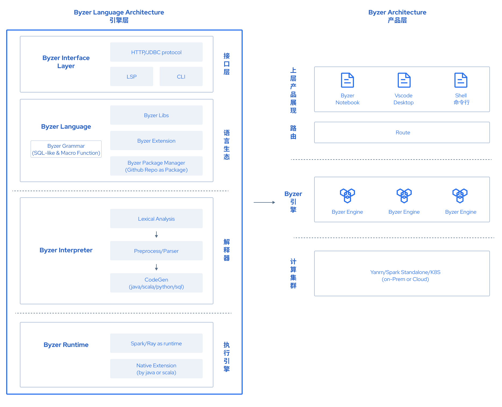

    [](https://opensource.org/licenses/Apache-2.0)

<p align="center">
    
</p>


## Byzer-lang

**Byzer** (former MLSQL) is a low-code, open-sourced and distributed programming language for data pipeline, analytics and AI in cloud native way.

**Deisgn protocol: Everything is a table.** Byzer is a SQL-like language, to simplify data pipeline, analytics and AI, combined with built-in algorithms and extensions.

We believe that everything is a table, a simple and powerful SQL-like language can significantly reduce human efforts of data development without switching different tools.

### Byzer Architecture



You can build a data product based on Byzer engine & Byzer-lang without interacting with computing framework directly like Spark in your data APP. Thus will simplify your data app significantly. 

For example, Byzer org contributes a data app [Byzer Notebook](https://github.com/byzer-org/byzer-notebook), which provides notebook interaction & workflow GUI interaction.

### BIP (Byzer Improvement Proposal)

Byzer project uses the [BIP](https://github.com/byzer-org/byzer-lang/wiki) for the community  collaboration, you can checkout the feature design or architecture design in BIP.

### Online Trial

You can access the official website [https://www.byzer.org/](https://www.byzer.org/) and try Byzer-lang & Byzer Notebook online.


### Download 

You can download Byzer engine via:
- [https://download.byzer.org/](https://download.byzer.org/)
- [Byzer Docker Hub](https://hub.docker.com/u/byzer)
- [Github Release](https://github.com/byzer-org/byzer-lang/releases)

For more details, please refer to the [docs](https://docs.byzer.org/#/byzer-lang/zh-cn/installation/README)

### Install

For **dev/test** purpose, you can download [Byzer All In One Package](https://docs.byzer.org/#/byzer-lang/zh-cn/installation/server/byzer-all-in-one-deployment), extract and then execute the command below

```
$ cd {BYZER_HOME}
$ ./bin/byzer.sh start
```


And for **production** purpose, we recommend to use [Byzer Server Package](https://docs.byzer.org/#/byzer-lang/zh-cn/installation/server/binary-installation) and deploy it on Hadoop.


You can also install [Byzer VSCode Extension](https://docs.byzer.org/#/byzer-lang/zh-cn/installation/vscode/byzer-vscode-extension-installation) to use Byzer-lang. 

For the Docker Image or , please refer to the [docs](https://docs.byzer.org/#/byzer-lang/zh-cn/installation/README)


### Byzer Code Example

Below list an example that how to process Github API as a table to get the information of Byzer Org

```sql
-- Get Github Organization Info

-- set API URL and params
SET org_name="byzer-org";
SET GITHUB_ORGANIZATION_URL="https://api.github.com/orgs/${org_name}";

-- Load Github Organization API as table
LOAD Rest.`$GITHUB_ORGANIZATION_URL` 
 where `config.connect-timeout`="10s"
 and `config.method`="GET"
 and `header.accept`="application/vnd.github.v3+json"
as github_org;


-- decode API response from binary to a json string
select string(content) as content from github_org as response_content;

-- expand the json string 
run response_content as JsonExpandExt.`` where inputCol="content" and structColumn="true" as github_org;

-- retrieve user infomation and process as a table
select content.* from github_org as org_info;

-- save the table to delta lake
save overwrite org_info as delta.`github_info_db.byzer_org`;
```


For more details about the Byzer-lang grammer, please refer to the user manaual [Byzer-lang Grammar](https://docs.byzer.org/#/byzer-lang/zh-cn/grammar/outline)

### Development

1. Fork this repository and clone to local machine

```
git clone https://github.com/{YOUR_GITHUB}/byzer-lang.git
```

2. Use Intellj Idea to open the project, choose the scala version `2.12.10`

3. In Intellj Idea Maven Setting, check the profile below
    - gpg
    - local
    - scala-2.12
    - spark-3.0.0
    - streamingpro-spark-3.0.0-adaptor

4. Click Maven Refresh and wait for Idea load finished

5. Find the class `tech.mlsql.example.app.LocalSparkServiceApp`, click Debug button then Byzer Engine will be started, then you can access the Byzer Web Console in [http://localhost:9003/](http://localhost:9003/#/)

### Build

You can refer to the project [byzer-org/byzer-build](https://github.com/byzer-org/byzer-build) to check how to build the Byzer engine binary packages and images

### How to contribute to Byzer-Lang

If you are planning to contribute to this project, please create an issue at [our Issue page](https://github.com/byzer-org/byzer-lang/issues)
even if the topic is not related to source code itself (e.g., documentation, new idea and proposal).

This is an active open source project for everyone,
and we are always open to people who want to use this system or contribute to it.

For more details about how to contribute to the Byzer Org, please refer to [How to Contribute](https://docs.byzer.org/#/byzer-lang/zh-cn/appendix/contribute)


### Contributors

<a href="https://github.com/byzer-org/byzer-lang/graphs/contributors">
  
</a>

Made with [contrib.rocks](https://contrib.rocks).

###  Community

- **Slack**: [byzer-org.slack.com](https://byzer-org.slack.com)
- **Wechat Official Account:** Byzer Community


