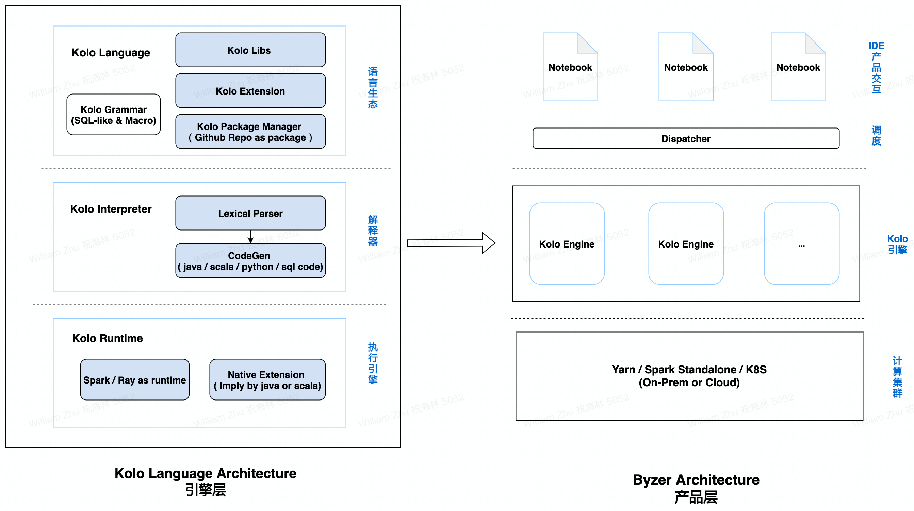

    [](https://opensource.org/licenses/Apache-2.0)


## TOC   
   * [Kolo-Lang](#kolo-lang)
      * [Kolo Code Example](#kolo-code-example)
      * [Kolo Architecture](#kolo-aritchitechture)
   * [Official WebSite](#official-website)
   * [VSCode Extension（MacOS、Linux）](#vscode-extensionmacoslinux)
   * [Docker Sandbox](#docker-sandbox)
      * [Pulling Sandbox Docker Image](#pulling-sandbox-docker-image)
      * [Start Container](#start-container)
   * [Download Kolo](#download-kolo)
   * [Building a Distribution](#building-a-distribution)
      * [Prerequisites](#prerequisites)
      * [Downloading Source Code](#downloading-source-code)
      * [Building Spark 2.4.3 Bundle](#building-spark-243-bundle)
      * [Building Spark 3.1.1 Bundle](#building-spark-311-bundle)
      * [Building without Chinese Analyzer](#building-without-chinese-analyzer)
      * [Building with Aliyun OSS Support](#building-with-aliyun-oss-support)
   * [Deploying](#deploying)
   * [How to contribute to Kolo-Lang](#how-to-contribute-to-kolo-lang)
   * [Contributors](#contributors)
   * [WeChat Group](#wechat-group)

## Kolo-Lang

**Kolo** (former MLSQL) is a low-code, open-sourced and distributed programming language for data pipeline, analytics and AI in cloud native way.

**Deisgn protocol: Everything is a table.** Kolo is a SQL-like language, to simplify data pipeline, analytics and AI, combined with built-in algorithms and extensions.

We believe that everything is a table, a simple and powerful SQL-like language can significantly reduce human efforts of data development without switching different tools.

### Kolo Architecture



### Kolo Code Example


```sql
load hive.`raw.stripe_discounts` as discounts;
load hive.`raw.stripe_invoice_items` as invoice_items;

select
        invoice_items.*,
        case
            when discounts.discount_type = 'percent'
                then amount * (1.0 - discounts.discount_value::float / 100)
            else amount - discounts.discount_value
        end as discounted_amount

    from invoice_items

    left outer join discounts
        on invoice_items.customer_id = discounts.customer_id
        and invoice_items.invoice_date > discounts.discount_start
        and (invoice_items.invoice_date < discounts.discount_end
             or discounts.discount_end is null)
as joined;


select

        id,
        invoice_id,
        customer_id,
        coalesce(discounted_amount, amount) as discounted_amount,
        currency,
        description,
        created_at,
        deleted_at

    from joined
as final;


set allColumns = "all,wow";

!if ''' split(:allColumns,",")[0] == "all" ''';
   select * from final as final2;
!else;
   select id,invoice from final as final2;
!fi;

select * from final2 as output;
```


## Official WebSite

[https://mlsql.tech](https://mlsql.tech) [New official website is coming soon]

## Notebook Support

[byzer-notebook](https://github.com/byzer-org/byzer-notebook)


## VSCode Extension（MacOS、Linux、Windows）

[VSCode IDE Extension](https://github.com/byzer-org/kolo-desktop)

[More document about kolo-lang vscode extension（Chinese version）](https://mlsql-docs.kyligence.io/latest/zh-hans/howtouse/mlsql_desktop_install.html)

## Docker Sandbox  (With Notebook)

```
export MYSQL_PASSWORD=${1:-root}
export SPARK_VERSION=${SPARK_VERSION:-3.1.1}
export MLSQL_VERSION=${MLSQL_VERSION:-2.2.0-SNAPSHOT}

docker run -d \
-p 3306:3306 \
-p 9002:9002 \
-p 9003:9003 \
-e MYSQL_ROOT_HOST=% \
-e MYSQL_ROOT_PASSWORD="${MYSQL_PASSWORD}" \
--name mlsql-sandbox-${SPARK_VERSION}-${MLSQL_VERSION} \
mlsql-sandbox:${SPARK_VERSION}-${MLSQL_VERSION}
```

Then you can visit `http://127.0.0.1:9002` .


## Download Kolo

* The latest stable version is release-2.1.0
* You can download from [Kolo Website](https://mlsql-downloads.kyligence.io/2.1.0/)
* Spark 2.4.3/3.1.1 have been tested

***Naming Convention***

mlsql-engine_${spark_major_version}-${mlsql_version}.tgz
```shell
## Pre-built for Spark 2.4.3
mlsql-engine_2.4-2.1.0.tar.gz

## Pre-built for Spark 3.1.1
mlsql-engine_3.0-2.1.0.tar.gz
```  

## Building a Distribution
### Prerequisites
- JDK 8+
- Maven
- Linux or MacOS

### Downloading Source Code
```shell
## Clone the code base
git clone https://github.com/byzer-org/kolo-lang.git
cd kolo-lang
```

### Building Spark 2.4.3 Bundle
```shell
export MLSQL_SPARK_VERSION=2.4
./dev/make-distribution.sh
```

### Building Spark 3.1.1 Bundle
```shell
export MLSQL_SPARK_VERSION=3.0
./dev/make-distribution.sh
```
### Building without Chinese Analyzer
```shell
## Chinese analyzer is enabled by default.
export ENABLE_CHINESE_ANALYZER=false
./dev/make-distribution.sh <spark_version>
```

## Deploying
1. [Download](#Download) or [build a distribution](#Build) 
2. Install Spark and set environment variable SPARK_HOME, make sure Spark version matches that of MLSQL
3. Deploy tgz
- Set environment variable MLSQL_HOME
- Copy distribution tar ball over and untar it

4.Start Kolo in local mode
```shell
cd $MLSQL_HOME
## Run process in background
nohup ./bin/start-local.sh 2>&1 > ./local_mlsql.log &
```
5. Open a browser and type in http://localhost:9003, have fun.

Directory structure
```shell
|-- mlsql
    |-- bin        
    |-- conf       
    |-- data       
    |-- examples   
    |-- libs       
    |-- README.md  
    |-- LICENSE
    |-- RELEASE
```

## How to contribute to Kolo-Lang

If you are planning to contribute to this repository, please create an issue at [our Issue page](https://github.com/byzer-org/kolo-lang/issues)
even if the topic is not related to source code itself (e.g., documentation, new idea and proposal).

This is an active open source project for everyone,
and we are always open to people who want to use this system or contribute to it.

For more details about how to contribute to the Byzer Org, please refer to [How to Contribute](https://docs.byzer.org/#/kolo-lang/zh-cn/appendix/contribute)


## Contributors

<a href="https://github.com/byzer-org/kolo-lang/graphs/contributors">
  
</a>

Made with [contrib.rocks](https://contrib.rocks).

##  WeChat Group

扫码添加K小助微信号，添加成功后，发送  mlsql  这5个英文字母进群。


